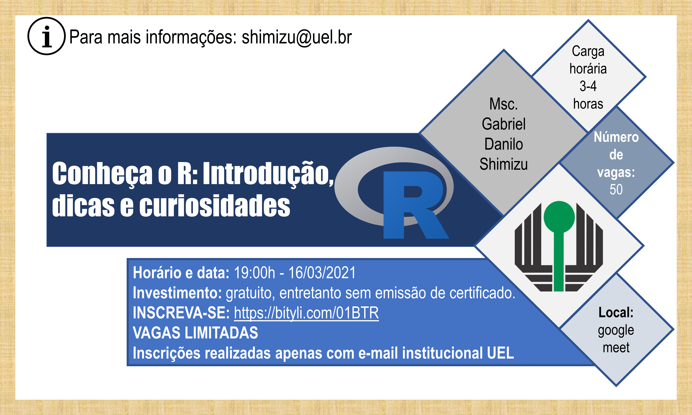

--- 
title: "Conheça o R: Introdução, dicas e curiosidades"
author: "Gabriel Danilo Shimizu"
date: "`r Sys.Date()`"
site: bookdown::bookdown_site
documentclass: book
bibliography: [book.bib, packages.bib]
biblio-style: apalike
link-citations: yes
---


# Apresentação

R é uma linguagem de programação muito utilizada na âmbito da estatística e na ciência de dados. Na Agronomia, o conhecimento sobre essa linguagem é um diferencial, sobretudo na carreira acadêmica, pois sua limitação gráfica e de análises é praticamente inexistente. 

Este curso, embora curto, representa um primeiro passo para os futuros usuários de R e, é essencial para a compreensão das diversas funcionalidades dessa linguagem de programação. 

   

<br><br>

Para acessar a sala de aula clique no ícone abaixo:

<center>

</center>

<br><br>

**Horário e data**: 19:00h - 16/03/2021

**Local**: remoto via google meet

**Carga horária**: de 3 a 4 horas

**Número de vagas**: 50

**Objetivo**: proporcionar um conhecimento mínimo sobre a linguagem R.

**Público alvo**: estudantes de pós-graduação em agronomia.

**Conteúdo**:

 - Introdução a linguagem R e ao ambiente Rstudio
 - Dicas de importação de dados, geração de gráficos, atalhos, pacotes e informações no geral
 - Curiosidades

**Investimento**: gratuito, entretanto sem emissão de certificado.

**Ministrante**: Gabriel Danilo Shimizu

VAGAS LIMITADAS: Inscrições realizadas apenas com e-mail institucional UEL

<br><br>

<!--  -->

```{r include=FALSE}
# automatically create a bib database for R packages
knitr::write_bib(c(
  .packages(), 'bookdown', 'knitr', 'rmarkdown'
), 'packages.bib')
```
